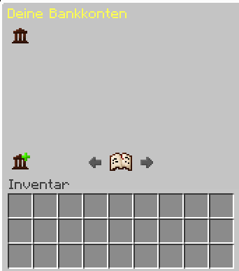
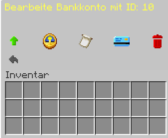
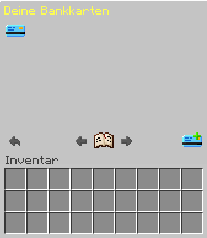
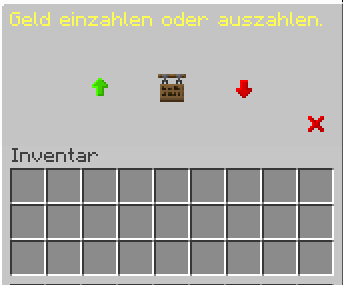

## Bankkonto erstellen
Begebe dich durch den Befehl **/warp** zur Bank. Um ein neues Bankkonto zu erstellen, klicke mit der rechten Maustaste auf den Bankier und wähle aus folgenden Optionen:

Wähle das Symbol unten mit dem kleinen Plus, um ein neues Konto zu erstellen. Nun drückst du auf das Icon, und automatisch erstellt sich für dich ein Bankkonto.

## Bankkonto verwalten

Wenn du bereits ein Konto besitzt, kannst du es mit dem Banksymbol verwalten. Dabei stehen dir folgende Möglichkeiten zur Verfügung:

- **Kontolimit erhöhen:** Erhöht das Limit deines Kontos, kostet jedoch Geld.
- **Kontostand:** Zeigt dir deinen aktuellen Kontostand an.
- **Transaktionen:** Zeigt dir deine Transaktionen an.
- **Bankkarte:** Zeigt dir deine Bankkarten an und ermöglicht deren Verwaltung.
- **Konto löschen:** Löscht dein Konto.

:::caution
Achtung: Dies kann nicht rückgängig gemacht werden!
:::

## Bankkarten erstellen

Erstelle Bankkarten, um dein Geld auch unterwegs zu verwalten. Klicke dazu mit der rechten Maustaste auf den Bankier und wähle aus folgenden Optionen:

Wähle die Bankkarte mit dem kleinen Plus, um eine neue Bankkarte zu erstellen. Gib eine PIN, ein Ausgabenlimit und eine Beschreibung für die Karte an. Um das Ausgabenlimit auf Unbegrenzt zu setzen, gebe einfach 0 ein. Nach erfolgreicher Erstellung kannst du die Bankkarte mit einem Rechtsklick auf die Karte im Untermenü verwalten.

Nach Abschluss dieser Schritte wird folgendes Menü angezeigt:

Hier kannst du alle deine Bankkarten sehen und verwalten.

## Bankkarten verwalten

Wenn du über die Karten hover, werden dir drei Möglichkeiten angezeigt:

- **Linksklick:** Hier kannst du deine PIN ändern.
- **Rechtsklick:** Hier kannst du deine Karte löschen.
- **Shift-Klick:** Hier kannst du deine Karte löschen.

:::caution
Achtung: Dies kann nicht rückgängig gemacht werden!
:::

## Geld abheben und einzahlen

Um Geld abzuheben oder einzuzahlen, klicke mit der rechten Maustaste auf einen Bankautomaten. Gib deine **PIN** ein und es wird folgendes Menü angezeigt:

Über den **Geld abheben**-Button kannst du Geld abheben, und über den **Geld einzahlen**-Button kannst du Geld einzahlen. Über das Schild kannst du dir deinen aktuellen Kontostand anzeigen lassen.