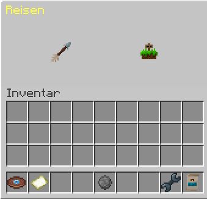
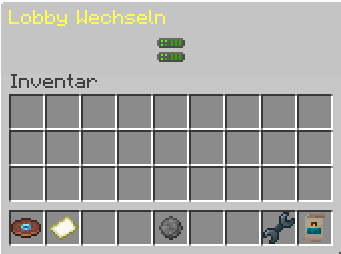
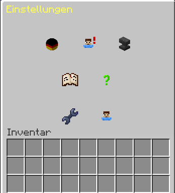
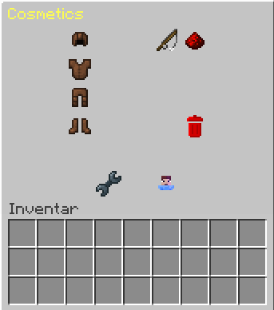

## Schallplatte

Über die Schallplatte könnt ihr euren Spielmodus auswählen. Die Schallplatte befindet sich in der Hotbar im ersten Slot. Wenn ihr die Schallplatte in der Hand haltet, könnt ihr mit der rechten Maustaste den Spielmodus auswählen.

## Papier

Du kannst die Lobby wechseln, indem du das Papier benutzt, das sich im 9. Slot deiner Hotbar befindet. Halte das Papier in der Hand und klicke mit der rechten Maustaste, um die Lobby zu wechseln.

## Einstellungen

Wenn du die Einstellungen öffnest, hast du zwei Seiten zur Auswahl:

- Einstellungen
- Kosmetika

### Einstellungen

In diesem Bereich hast du die Möglichkeit, deine Spracheinstellungen anzupassen und Informationen zu Stummschaltungen sowie Ausschlüssen einzusehen. Zusätzlich findest du nützliche Links zu unserer Dokumentation und zu unserem Ticket-Support, falls du weitere Unterstützung benötigst. Hier stehen dir alle wichtigen Ressourcen zur Verfügung, um deine Erfahrung optimal zu gestalten und eventuelle Anliegen zu klären.

### Kosmetika

Hier kannst du deine Ausrüstung nach Belieben individualisieren. Probiere verschiedene Rüstungskomponenten aus, wähle dein Gadget sorgfältig aus und verleihe deinem Charakter mit Partikeln eine persönliche Note. Entdecke die Vielfalt der Anpassungsmöglichkeiten und gestalte deine Ausstattung nach deinem eigenen Stil und den Anforderungen deiner Abenteuer. Tauche ein und mache jede Ausrüstungsänderung zu einem Ausdruck deiner Einzigartigkeit in der Welt, die du erkundest.

### Kontakte

Hier hast du die Möglichkeit, Freunde hinzuzufügen und mit ihnen zu chatten. Zusätzlich kannst du auch deines Freundes anfragen verwalten und einsehen. Tauche ein in die Welt der sozialen Interaktion und genieße die Möglichkeit, in Verbindung zu bleiben!