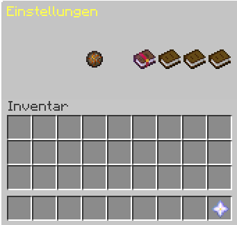

OneHit ist ein Spielmodus, in dem du auf unserem Server im Multiplayer spielend Coins verdienen kannst. Das Ziel des OneHit-Modus ist es, den Gegner mit einem einzigen Schwert- oder Bogenschuss zu neutralisieren.
## Zusatzfunktionen

Während des Spiels werdet ihr von individuell erstellten Nachrichten begleitet, und ihr habt die Möglichkeit, zusätzliche Nachrichtenpakete zu erwerben. Um das Spielerlebnis zu verbessern, könnt ihr außerdem einen Booster erwerben, der euch schnell von eurer Spawnposition fortbewegt.

