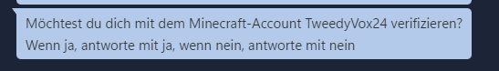

:::caution
Die Verifizierung im Support Panel ist derzeit nicht möglich und steht vorläufig auch nicht auf der Planungsagenda.
:::

### Vorteile im Teamspeak:

Durch die Verifizierung erhältst du Priorität im Support, die Option auf einen permanenten Teamspeak-Channel und hebst dich von der Masse der Spieler ab. Weitere Vorteile werden in Zukunft folgen.
### Vorteile im Discord:

Durch die Discord-Verifizierung erhältst du Zugang zu exklusiven Giveaways und Events, die ausschließlich Premium-Spielern vorbehalten sind. Weitere Vorteile werden in Zukunft folgen.


# Wie funktioniert die Verifizierung?

Zur Verifizierung musst du im Spiel diesen Befehl eingeben.
```
/verify
```

Nachdem du diesen Befehl im Spiel ausgeführt hast, erscheint eine Auswahl an verfügbaren Optionen. Eine detaillierte Erklärung dazu findest du weiter unten.


## Wie verifiziert man sich im Teamspeak?

Im Spiel musst du den Befehl `/verify teamspeak` eingeben. Anschließend wird dir eine Liste mit Accounts angezeigt, die noch nicht verifiziert sind. Nun wählst du deinen Account auf dem Teamspeak Server aus.


Nachfolgend erhältst du eine Chatnachricht, die dich darüber informiert, dass du nun im Teamspeak eine Nachricht von unserem Verifizierungs-Bot bekommen hast.


Nun musst du im Teamspeak noch bestätigen, dass dies dein Account ist, indem du dem Bot ```Ja``` schreibst.



# Wie verifiziert man sich im Discord?

Im Spiel musst du den Befehl `/verify Discord` eingeben. Danach erhältst du im Chat eine Nachricht.


Nachdem du auf den Link geklickt hast, öffnet sich dein Discord im Browser. Falls du noch nicht bei Discord angemeldet bist, musst du das vor dem Verifizierungsprozess tun. Nachdem du dich angemeldet hast, erscheint ein weiteres Fenster in deinem Browser.


Dann musst du noch auf "Autorisieren" klicken. Anschließend wirst du auf eine Website weitergeleitet und bist erfolgreich verifiziert.

:::note
Falls die Verifizierung nicht erfolgreich war, melde dich bitte beim Support. Ein Teammitglied wird dir dann gerne weiterhelfen.
:::