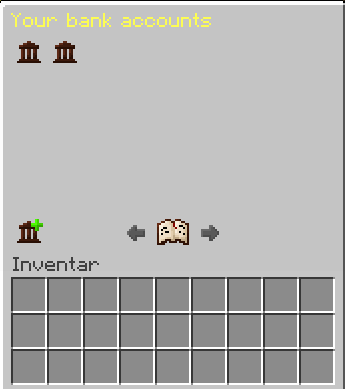
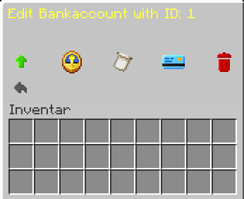
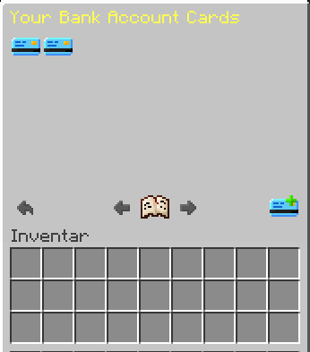
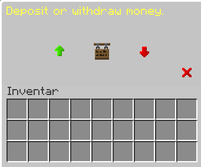

## Create bank account
Go to the bank with the command **/warp**. To create a new bank account, right-click on the banker and choose from the following options:

Select the symbol at the bottom with the small plus to create a new account. Now click on the icon and a bank account will automatically be created for you.

## Manage bank account

If you already have an account, you can manage it using the bank icon. The following options are available to you:

- **Increase account limit:** Increases the limit of your account, but costs money.
- Account balance:** Shows you your current account balance.
- Transactions:** Shows you your transactions.
- Bank card:** Shows you your bank cards and allows you to manage them.
- **Delete account:** Deletes your account.

:::caution
Attention: This cannot be undone!
:::

## Create bank cards

Create bank cards to manage your money on the go. Right-click on the banker and choose from the following options:

Select the bank card with the small plus to create a new bank card. Enter a PIN, a spending limit and a description for the card. To set the spending limit to Unlimited, simply enter 0. After successful creation, you can manage the bank card by right-clicking on the card in the submenu.

After completing these steps, the following menu will be displayed:

Here you can see and manage all your bank cards.

## Manage bank cards

If you hover over the cards, you will be shown three options:

- **Left click:** Here you can change your PIN.
- **Right-click:** Here you can delete your card.
- Shift-click:** You can delete your card here.

:::caution

Attention: This cannot be undone!
:::

## Withdrawing and depositing money

To withdraw or deposit money, right-click on an ATM. Enter your **PIN** and the following menu will appear:

You can withdraw money using the **withdraw money** button and deposit money using the **deposit money** button. You can display your current account balance via the sign.