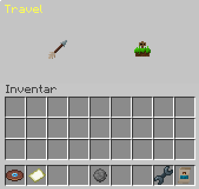

## Record

You can select your game mode using the record. The record is located in the hot bar in the first slot. When you hold the record in your hand, you can select the game mode with the right mouse button.

## Paper

You can change the lobby by using the paper, which is located in the 9th slot of your hot bar. Hold the paper in your hand and right-click to change the lobby.

## Settings

When you open the settings, you have two pages to choose from:

- Settings
- Cosmetics

### Settings

In this area, you have the opportunity to adjust your language settings and view information about mutes and exclusions. Additionally, you will find useful links to our documentation and our ticket support in case you need further assistance. Here, all important resources are available to optimize your experience and clarify any concerns.

### Cosmetics

Here, you can customize your equipment as you wish. Try out different armor components, carefully choose your gadget, and give your character a personal touch with particles. Discover the variety of customization options and design your equipment according to your own style and the requirements of your adventures. Dive in and make every equipment change an expression of your uniqueness in the world you are exploring.

