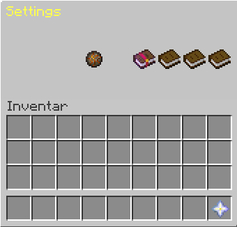

OneHit is a game mode where you can earn coins by playing on our multiplayer server. The goal of the OneHit mode is to neutralize the opponent with a single sword or bow shot.
## Additional Features

During the game, you will be accompanied by individually created messages, and you have the option to purchase additional message packs. To enhance your gaming experience, you can also acquire a booster that quickly moves you away from your spawn position.

