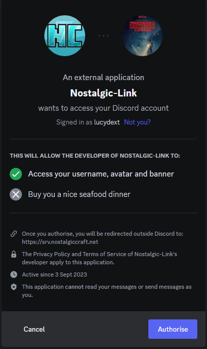

:::caution[Attention]
Verification in the Support Panel is currently not possible and is not on the planning agenda for the time being.
:::

### Advantages in Teamspeak:

Verification gives you priority in support, the option of a permanent Teamspeak channel and makes you stand out from the crowd. Further advantages will follow in the future.
### Advantages in Discord:

Discord verification gives you access to exclusive giveaways and events reserved exclusively for premium players. More benefits will follow in the future.


### How does verification work?

To verify, you must enter this command in-game.
```
/verify
```

After you have executed this command in the game, a selection of available options will appear. A detailed explanation can be found below.


## How do I verify myself in Teamspeak?

In the game you have to enter the command `/verify teamspeak`. You will then be shown a list of accounts that have not yet been verified. Now select your account on the Teamspeak server.


You will then receive a chat message informing you that you have now received a message from our verification bot in Teamspeak.


Now you have to confirm in Teamspeak that this is your account by writing ```Yes``` to the bot.


# How to verify yourself in Discord?

In the game you have to enter the command `/verify Discord`. You will then receive a message in the chat.


After you have clicked on the link, your Discord will open in your browser. If you are not yet logged in to Discord, you must do so before the verification process. After you have logged in, another window will appear in your browser.



Then you have to click on "Authorize". You will then be redirected to a website and are successfully verified.

:::note[Note]
If the verification was not successful, please contact support. A team member will be happy to help you.
:::